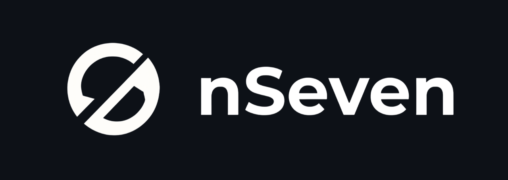

**Monitoramento regulatório inteligente para empresas que valorizam conformidade e eficiência.**

## Sobre a Organização

A nSeven é uma organização focada em desenvolver soluções inovadoras para monitoramento regulatório e conformidade empresarial. Nossa missão é auxiliar empresas na manutenção de conformidade com regulamentações como LGPD (Lei Geral de Proteção de Dados) e outras normas aplicáveis.

## Licença

Todos os projetos da nSeven estão licenciados sob a Licença MIT - veja o arquivo [LICENSE](LICENSE) para detalhes.

---

**Desenvolvido pela equipe nSeven**

[Website](https://nseven.vercel.app) • [Documentação](https://nseven.vercel.app/docs) • [Suporte](https://nseven.vercel.app/support)

